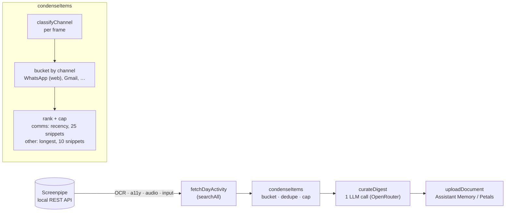

# screenpipe-distiller

Turn your daily computer activity into durable, searchable memory.

`screenpipe-distiller` reads a day of [Screenpipe](https://screenpi.pe) capture (screen OCR, UI, audio), distills it with an LLM into a single concise Markdown document — what you worked on, who you talked to, the tools you used, what you read, and any notable things you articulated — and ingests it into an Assistant Memory backend (or any compatible endpoint).

It is deliberately **not** a to-do generator. The curation contract forbids action items, refuses to infer intent from passive viewing, and won't guess which project an ambiguous reference belongs to — so your memory stays clean.

## How it works

```
Screenpipe (local capture) -> condense -> curate (LLM) -> ingest into Assistant Memory
```

- **condense** (deterministic, no LLM): groups a day's frames by app / window / URL, keeps the most recent snippets for conversation channels and the longest substantive blocks for everything else, drops noise — turning thousands of frames into a few KB.
- **curate** (one LLM call via OpenRouter): writes a durable activity document under a strict contract (durable over ephemeral, no action items, exposure != intent, no cross-project misattribution, capture notable knowledge).
- **ingest**: uploads as a `personal`-scope document keyed per day; re-running a day is rejected as a conflict unless you pass `--update-existing`, which replaces the prior doc (handy after fixing curation).

## Architecture

The distiller runs a four-stage pipeline once per day:



**Browser-conversation routing** lives inside `condenseItems`: each captured frame is classified by `classifyChannel` (`src/channels.ts`), which re-buckets browser-based conversations like WhatsApp Web or Gmail under their own synthetic label (`WhatsApp (web)`, `Gmail`) and flags them for conversation treatment — a larger, recency-first text budget and protection from the top-N app cutoff — so they no longer drown inside a single generic browser bucket.

## Requirements

- [Bun](https://bun.sh) (the core tool is cross-platform; the scheduling helpers are macOS/launchd)
- [Screenpipe](https://screenpi.pe) running locally
- An [OpenRouter](https://openrouter.ai) API key (any model)
- An Assistant Memory backend — or a Petals proxy

## Setup

```bash
bun install
cp .env.example .env   # then fill it in
```

Get your Screenpipe token with `screenpipe auth token`. At minimum set `SCREENPIPE_API_KEY`, `OPENROUTER_API_KEY`, `USER_NAME`, and — for the default direct mode — `MEMORY_API_URL` + `MEMORY_USER_ID`.

### Message ingestion

- [Understand captured and structured message-ingestion sources](docs/messaging-connectors.md)
- [Pair WhatsApp for persistent structured ingestion](docs/whatsapp-connector.md)
- WhatsApp messages from the paired sidecar are folded into each daily distill automatically (set `WHATSAPP_CONNECTOR=off` to use screen capture only).

## Usage

```bash
bun run distill                                # distill (today after noon, else yesterday)
bun run distill --date 2026-06-05              # a specific day
bun run distill --date 2026-06-05 --dry-run    # preview the document without uploading
bun run distill --date 2026-06-05 --update-existing  # re-upload, replacing the existing day's doc
bun run health-check                           # check Screenpipe recording health
bun test                                       # run the test suite
```

## Scheduling (macOS)

```bash
./scripts/install-record-app.sh         # audio + screen recorder autostart (recommended, macOS)
./scripts/install-schedules.sh          # daily distill (22:00) + health checks (12:00 & 20:00)
```

`install-record-app.sh` wraps `screenpipe record` in a tiny ad-hoc-signed `.app` launched via LaunchServices. This is required for audio on macOS: a bare `screenpipe` started by launchd has no code identity, so it can never hold a microphone grant — the app bundle gives it one. On first launch, approve the **Microphone** prompt (and grant **Accessibility** + **Input Monitoring** to "Screenpipe Recorder" for full screen-text and UI capture). Pin a mic with `AUDIO_DEVICE="MacBook Pro Microphone (input)"`, follow the system default with `AUDIO_DEVICE=""`, or skip audio entirely with `RECORD_AUDIO=0`. Don't re-run the installer after granting permissions — recompiling changes the signature and resets the grants.

For a screen-only recorder with no microphone (and no compiler needed), use `./scripts/install-record-autostart.sh` instead.

The daily run targets the current day in the evening; if the machine was asleep and the job fires the next morning instead, it falls back to the previous day so the right day is always captured.

## Upload modes

- `UPLOAD_MODE=direct` (default): posts to `{MEMORY_API_URL}/ingest/document` with your `MEMORY_USER_ID` (and optional `MEMORY_API_KEY`).
- `UPLOAD_MODE=petals`: posts through a Petals proxy with `PETALS_API_KEY`.

## License

MIT (c) 2026 Marcel Samyn
