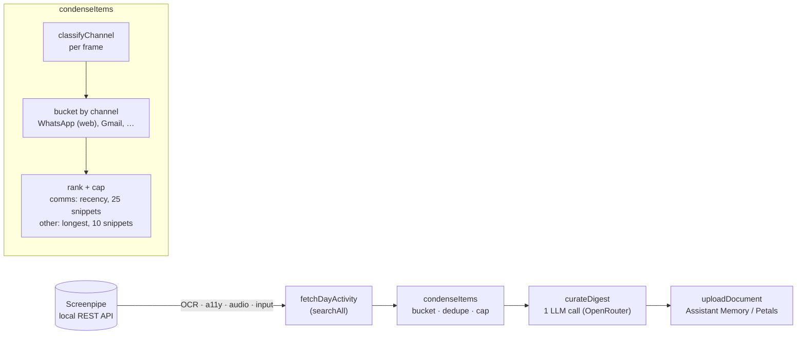

# Browser-Based Conversation Detection Implementation Plan

> **For agentic workers:** REQUIRED SUB-SKILL: Use superpowers:subagent-driven-development (recommended) or superpowers:executing-plans to implement this plan task-by-task. Steps use checkbox (`- [ ]`) syntax for tracking.

**Goal:** Route browser-based conversations (WhatsApp Web, Gmail, Slack web, etc.) through the existing communication-app handling so they get their own bucket, the larger recency-first text budget, and survive the top-N app cutoff.

**Architecture:** Extract channel classification into a new `src/channels.ts` module owning `classifyChannel(content)`, which returns a `{ bucketKey, isComms }` decision per frame. The condenser (`src/screenpipe.ts`) buckets by `bucketKey` instead of raw `app_name` and reads `isComms` off each accumulator instead of recomputing `isCommunicationApp(app)`. `AppActivity` (the public digest shape) stays unchanged — comms-ness rides a local ranked tuple only. The curation prompt gains guidance for sidebar-only captures, and the README gets an Architecture section with a Mermaid diagram.

**Tech Stack:** TypeScript, Bun (runtime + test runner + `bun run type-check`), Zod (already used for boundary parsing).

---

## File Structure

- **Create `src/channels.ts`** — content classification: `FrameContent`, `ChannelClassification`, `BrowserChannel`, `BROWSER_CHANNELS`, `COMMUNICATION_APPS`, `isCommunicationApp`, `isBrowser`, `classifyChannel`. Single responsibility: given a frame's identifying fields, decide its conversation bucket + whether it gets comms treatment.
- **Create `src/channels.test.ts`** — unit tests for `classifyChannel`.
- **Modify `src/screenpipe.ts`** — remove the local `COMMUNICATION_APPS` / `isCommunicationApp` (now imported); bucket by `classifyChannel().bucketKey`; carry `isComms` on the accumulator and through a local ranked tuple.
- **Modify `src/screenpipe.condense.test.ts`** — extend with browser-channel split/budget/survival cases.
- **Modify `src/curation-prompt.ts`** — extend rule 6 for browser-based comms + sidebar-only honesty.
- **Modify `README.md`** — add `## Architecture` section with Mermaid pipeline diagram.

---

## Task 1: Create `src/channels.ts` with classification logic

**Files:**
- Create: `src/channels.ts`
- Test: `src/channels.test.ts`

- [ ] **Step 1: Write the failing test**

Create `src/channels.test.ts`:

```ts
import { describe, expect, test } from "bun:test";
import { classifyChannel, isCommunicationApp } from "./channels";

describe("classifyChannel", () => {
  test("WhatsApp Web by URL → WhatsApp (web) comms bucket", () => {
    expect(
      classifyChannel({ app_name: "Google Chrome", browser_url: "https://web.whatsapp.com/" }),
    ).toEqual({ bucketKey: "WhatsApp (web)", isComms: true });
  });

  test("WhatsApp Web by title only (no browser_url) → WhatsApp (web) comms bucket", () => {
    expect(
      classifyChannel({ app_name: "Google Chrome", window_title: "WhatsApp — 3 unread" }),
    ).toEqual({ bucketKey: "WhatsApp (web)", isComms: true });
  });

  test("title match in a non-browser app stays generic", () => {
    expect(
      classifyChannel({ app_name: "Zed", window_title: "whatsapp.ts — screenpipe-distiller" }),
    ).toEqual({ bucketKey: "Zed", isComms: false });
  });

  test("native WhatsApp desktop app keeps its own name (not the web label)", () => {
    expect(classifyChannel({ app_name: "WhatsApp" })).toEqual({ bucketKey: "WhatsApp", isComms: true });
  });

  test("generic Chrome tab is not comms", () => {
    expect(
      classifyChannel({ app_name: "Google Chrome", browser_url: "https://github.com/foo/bar" }),
    ).toEqual({ bucketKey: "Google Chrome", isComms: false });
  });

  test("Gmail by URL → Gmail comms bucket", () => {
    expect(
      classifyChannel({ app_name: "Google Chrome", browser_url: "https://mail.google.com/mail/u/0/" }),
    ).toEqual({ bucketKey: "Gmail", isComms: true });
  });

  test("missing app_name falls back to Unknown, not comms", () => {
    expect(classifyChannel({})).toEqual({ bucketKey: "Unknown", isComms: false });
  });

  test("isCommunicationApp still recognizes native Slack", () => {
    expect(isCommunicationApp("Slack")).toBe(true);
    expect(isCommunicationApp("Zed")).toBe(false);
  });
});
```

- [ ] **Step 2: Run test to verify it fails**

Run: `bun test src/channels.test.ts`
Expected: FAIL — `Cannot find module './channels'` (the module does not exist yet).

- [ ] **Step 3: Write the implementation**

Create `src/channels.ts`:

```ts
/**
 * Conversation-channel classification for captured frames.
 * Aliases: channel detection, comms bucketing, browser conversation routing.
 *
 * Given a frame's identifying fields, decide which bucket it belongs to and
 * whether that bucket gets conversation treatment (recency sort, larger text
 * budget, rank protection). Native comms apps keep their own name; browser-based
 * conversations (WhatsApp Web, Gmail, …) are re-bucketed under a synthetic label
 * so they no longer drown in a single generic "Google Chrome" bucket.
 */

/** Minimal frame fields needed to classify a frame's conversation channel. */
export interface FrameContent {
  app_name?: string | null;
  window_name?: string | null;
  window_title?: string | null;
  browser_url?: string | null;
}

export interface ChannelClassification {
  /** The label this frame is bucketed under in the digest (the "app"). */
  bucketKey: string;
  /** Whether this bucket gets conversation treatment (recency sort, larger budget, rank protection). */
  isComms: boolean;
}

interface BrowserChannel {
  /** bucketKey when matched, e.g. "WhatsApp (web)". */
  display: string;
  /** Matched as substrings of browser_url (lowercased). */
  urlPatterns: string[];
  /** Matched as substrings of the window title (lowercased); only when the app is a browser. */
  titlePatterns: string[];
}

const BROWSER_CHANNELS: BrowserChannel[] = [
  { display: "WhatsApp (web)", urlPatterns: ["web.whatsapp.com"], titlePatterns: ["whatsapp"] },
  { display: "Slack (web)", urlPatterns: ["app.slack.com"], titlePatterns: ["slack"] },
  { display: "Gmail", urlPatterns: ["mail.google.com"], titlePatterns: ["gmail"] },
  { display: "Messenger (web)", urlPatterns: ["messenger.com"], titlePatterns: ["messenger"] },
  { display: "Discord (web)", urlPatterns: ["discord.com/channels", "discord.com/app"], titlePatterns: ["discord"] },
  { display: "Telegram (web)", urlPatterns: ["web.telegram.org"], titlePatterns: ["telegram"] },
  { display: "Teams (web)", urlPatterns: ["teams.microsoft.com", "teams.live.com"], titlePatterns: ["microsoft teams"] },
];

// Native communication apps whose on-screen text is conversation, not UI chrome.
// Lowercased substring match against app_name.
const COMMUNICATION_APPS = [
  "slack",
  "messages",
  "mail",
  "whatsapp",
  "discord",
  "telegram",
  "signal",
  "zoom",
  "microsoft teams",
  "teams",
  "messenger",
  "superhuman",
  "outlook",
];

const BROWSERS = ["chrome", "safari", "arc", "firefox", "edge", "brave", "vivaldi", "opera"];

export function isCommunicationApp(app: string): boolean {
  const a = app.toLowerCase();
  return COMMUNICATION_APPS.some((name) => a.includes(name));
}

function isBrowser(app: string): boolean {
  const a = app.toLowerCase();
  return BROWSERS.some((b) => a.includes(b));
}

/**
 * Classify a frame into a conversation bucket.
 *
 * Precedence: native comms app → browser-based channel → generic. Native first
 * keeps a desktop WhatsApp/Teams app under its real name rather than a "(web)"
 * label. Title matching is gated on the app being a browser so that, e.g., a
 * `whatsapp.ts` file open in an editor is never mistaken for a conversation.
 */
export function classifyChannel(c: FrameContent): ChannelClassification {
  const app = (c.app_name ?? "Unknown").trim() || "Unknown";
  if (isCommunicationApp(app)) return { bucketKey: app, isComms: true };

  const url = (c.browser_url ?? "").toLowerCase();
  const title = `${c.window_name ?? ""} ${c.window_title ?? ""}`.toLowerCase();
  const browser = isBrowser(app);
  for (const ch of BROWSER_CHANNELS) {
    const urlHit = url !== "" && ch.urlPatterns.some((p) => url.includes(p));
    const titleHit = browser && ch.titlePatterns.some((p) => title.includes(p));
    if (urlHit || titleHit) return { bucketKey: ch.display, isComms: true };
  }

  return { bucketKey: app, isComms: false };
}
```

- [ ] **Step 4: Run test to verify it passes**

Run: `bun test src/channels.test.ts`
Expected: PASS (8 tests).

- [ ] **Step 5: Commit**

```bash
git add src/channels.ts src/channels.test.ts
git commit -m "✨ feat(channels): classify browser-based conversation channels"
```

---

## Task 2: Wire `classifyChannel` into the condenser

**Files:**
- Modify: `src/screenpipe.ts`
- Test: `src/screenpipe.condense.test.ts` (extended in Task 3; existing tests must keep passing here)

- [ ] **Step 1: Replace the local comms detection with an import**

In `src/screenpipe.ts`, replace the import block near the top:

```ts
import { z } from "zod";
import type { AppActivity, DayDigest } from "./types";
import { dayWindowUtc } from "./date-utils";
```

with:

```ts
import { z } from "zod";
import type { AppActivity, DayDigest } from "./types";
import { dayWindowUtc } from "./date-utils";
import { classifyChannel } from "./channels";
```

- [ ] **Step 2: Delete the moved `COMMUNICATION_APPS` / `isCommunicationApp`**

Delete this entire block from `src/screenpipe.ts` (currently lines 91-114):

```ts
// Native communication apps whose on-screen text is conversation, not UI chrome.
// Lowercased substring match against app_name. Browser-based comms (Slack web,
// Gmail) still flow through the generic path; widening detection to the browser
// would over-capture unrelated tabs, so that is deliberately left as a follow-up.
const COMMUNICATION_APPS = [
  "slack",
  "messages",
  "mail",
  "whatsapp",
  "discord",
  "telegram",
  "signal",
  "zoom",
  "microsoft teams",
  "teams",
  "messenger",
  "superhuman",
  "outlook",
];

function isCommunicationApp(app: string): boolean {
  const a = app.toLowerCase();
  return COMMUNICATION_APPS.some((name) => a.includes(name));
}
```

(Keep the `SYSTEM_AUDIO_SPEAKER` constant and everything below it.)

- [ ] **Step 3: Bucket by `classifyChannel` and store `isComms` on the accumulator**

In `condenseItems`, replace this line (currently line 150-151):

```ts
    const app = (c.app_name ?? "Unknown").trim() || "Unknown";
    const acc = byApp.get(app) ?? newAcc();
```

with:

```ts
    const { bucketKey, isComms } = classifyChannel(c);
    const acc = byApp.get(bucketKey) ?? newAcc(isComms);
    byApp.set(bucketKey, acc);
```

Then delete the now-duplicate `byApp.set(app, acc);` line that immediately followed the original (was line 152), since the set now happens above with `bucketKey`.

- [ ] **Step 4: Update `AppActivityAcc` and `newAcc` to carry `isComms`**

Replace the `AppActivityAcc` interface and `newAcc` (currently lines 213-225):

```ts
interface AppActivityAcc {
  windows: string[];
  urls: string[];
  texts: { len: number; snippet: string; ts: string }[];
  seenText: Set<string>;
  firstSeen: string | null;
  lastSeen: string | null;
  frames: number;
}

function newAcc(): AppActivityAcc {
  return { windows: [], urls: [], texts: [], seenText: new Set(), firstSeen: null, lastSeen: null, frames: 0 };
}
```

with:

```ts
interface AppActivityAcc {
  isComms: boolean;
  windows: string[];
  urls: string[];
  texts: { len: number; snippet: string; ts: string }[];
  seenText: Set<string>;
  firstSeen: string | null;
  lastSeen: string | null;
  frames: number;
}

function newAcc(isComms: boolean): AppActivityAcc {
  return { isComms, windows: [], urls: [], texts: [], seenText: new Set(), firstSeen: null, lastSeen: null, frames: 0 };
}
```

- [ ] **Step 5: Rank using `a.isComms`, carrying comms-ness on a local tuple**

Replace the ranking + cutoff block (currently lines 169-196):

```ts
  const ranked: AppActivity[] = [...byApp.entries()]
    .map(([app, a]) => {
      const comms = isCommunicationApp(app);
      // Conversations: keep the most RECENT thread content with a larger budget.
      // Everything else: keep the longest distinct blocks (prose > UI chrome).
      const ordered = comms
        ? [...a.texts].sort((t1, t2) => (t1.ts < t2.ts ? 1 : t1.ts > t2.ts ? -1 : 0))
        : [...a.texts].sort((t1, t2) => t2.len - t1.len);
      const budget = comms ? MAX_SAMPLE_TEXT_PER_COMMS_APP : MAX_SAMPLE_TEXT_PER_APP;
      return {
        app,
        windows: a.windows,
        urls: a.urls,
        sampleText: ordered.slice(0, budget).map((t) => t.snippet),
        firstSeen: a.firstSeen ?? "",
        lastSeen: a.lastSeen ?? "",
        frames: a.frames,
      };
    })
    .sort((x, y) => y.frames - x.frames);

  // Keep the top apps by activity, but never drop a communication app that has
  // real conversation text just because it was low-frame — those are high value.
  const top = ranked.slice(0, MAX_APPS);
  const extraComms = ranked
    .slice(MAX_APPS)
    .filter((a) => isCommunicationApp(a.app) && a.sampleText.length > 0);
  const apps = [...top, ...extraComms];
```

with:

```ts
  const ranked = [...byApp.entries()]
    .map(([app, a]) => {
      // Conversations: keep the most RECENT thread content with a larger budget.
      // Everything else: keep the longest distinct blocks (prose > UI chrome).
      const ordered = a.isComms
        ? [...a.texts].sort((t1, t2) => (t1.ts < t2.ts ? 1 : t1.ts > t2.ts ? -1 : 0))
        : [...a.texts].sort((t1, t2) => t2.len - t1.len);
      const budget = a.isComms ? MAX_SAMPLE_TEXT_PER_COMMS_APP : MAX_SAMPLE_TEXT_PER_APP;
      const activity: AppActivity = {
        app,
        windows: a.windows,
        urls: a.urls,
        sampleText: ordered.slice(0, budget).map((t) => t.snippet),
        firstSeen: a.firstSeen ?? "",
        lastSeen: a.lastSeen ?? "",
        frames: a.frames,
      };
      return { activity, isComms: a.isComms };
    })
    .sort((x, y) => y.activity.frames - x.activity.frames);

  // Keep the top apps by activity, but never drop a communication channel that
  // has real conversation text just because it was low-frame — those are high value.
  const top = ranked.slice(0, MAX_APPS);
  const extraComms = ranked.slice(MAX_APPS).filter((r) => r.isComms && r.activity.sampleText.length > 0);
  const apps = [...top, ...extraComms].map((r) => r.activity);
```

- [ ] **Step 6: Run the existing condense tests to verify no regressions**

Run: `bun test src/screenpipe.condense.test.ts`
Expected: PASS — all existing tests still green. Note the existing test `"gives communication apps a larger, recency-biased text budget"` uses `app="Slack"` (native comms, still classified `isComms: true` via `isCommunicationApp`), and `"groups by app…"` uses `app="Chrome"` with GitHub URLs (generic, `isComms: false`), so both behave as before.

- [ ] **Step 7: Type-check**

Run: `bun run type-check`
Expected: clean (no errors).

- [ ] **Step 8: Commit**

```bash
git add src/screenpipe.ts
git commit -m "♻️ refactor(condense): bucket frames via classifyChannel"
```

---

## Task 3: Extend condense tests for browser-channel routing

**Files:**
- Modify: `src/screenpipe.condense.test.ts`

- [ ] **Step 1: Add the browser-routing test cases**

In `src/screenpipe.condense.test.ts`, the existing `ocr` helper already accepts `(app, text, ts, url?, window?)` — note `window` maps to `window_name`, which `classifyChannel` reads. Add these tests inside the `describe("condenseItems", …)` block, after the last existing test (before the closing `});`):

```ts
  test("splits a WhatsApp-Web frame out of the generic Chrome bucket", () => {
    const items: SearchItem[] = [
      ocr("Google Chrome", "GitHub - foo/bar", "2026-06-12T09:00:00Z", "https://github.com/foo/bar", "foo/bar"),
      ocr("Google Chrome", "Lorena: thanks so much!! 🎉", "2026-06-12T09:05:00Z", "https://web.whatsapp.com/", "WhatsApp"),
    ];
    const digest = condenseItems(items, "2026-06-12");
    const whatsapp = digest.apps.find((a) => a.app === "WhatsApp (web)");
    const chrome = digest.apps.find((a) => a.app === "Google Chrome");
    expect(whatsapp).toBeDefined();
    expect(whatsapp?.sampleText).toContain("Lorena: thanks so much!! 🎉");
    expect(chrome).toBeDefined();
    expect(chrome?.sampleText).toContain("GitHub - foo/bar");
    expect(chrome?.sampleText).not.toContain("Lorena: thanks so much!! 🎉");
  });

  test("gives a browser comms channel the larger, recency-first budget", () => {
    const items: SearchItem[] = Array.from({ length: 20 }, (_, i) =>
      ocr(
        "Google Chrome",
        `message ${String(i).padStart(2, "0")}`,
        `2026-06-12T09:${String(i).padStart(2, "0")}:00Z`,
        "https://web.whatsapp.com/",
        "WhatsApp",
      ),
    );
    const digest = condenseItems(items, "2026-06-12");
    const whatsapp = digest.apps.find((a) => a.app === "WhatsApp (web)");
    expect(whatsapp?.sampleText.length).toBe(20); // above the non-comms cap of 10
    expect(whatsapp?.sampleText[0]).toBe("message 19"); // most recent first
  });

  test("never drops a low-frame browser comms channel", () => {
    const items: SearchItem[] = [
      ...Array.from({ length: 25 }, (_, i) => ocr(`App${i}`, "x".repeat(60), `2026-06-12T08:00:0${i % 10}Z`)),
      ocr("Google Chrome", "Lorena: see you tonight", "2026-06-12T09:00:00Z", "https://web.whatsapp.com/", "WhatsApp"),
    ];
    const warn = spyOn(console, "warn").mockImplementation(() => {});
    const digest = condenseItems(items, "2026-06-12");
    expect(digest.apps.find((a) => a.app === "WhatsApp (web)")).toBeDefined();
    warn.mockRestore();
  });
```

- [ ] **Step 2: Run the condense tests to verify they pass**

Run: `bun test src/screenpipe.condense.test.ts`
Expected: PASS — all existing tests plus the 3 new ones.

- [ ] **Step 3: Run the full test suite + type-check**

Run: `bun test`
Expected: PASS — all suites green.

Run: `bun run type-check`
Expected: clean.

- [ ] **Step 4: Commit**

```bash
git add src/screenpipe.condense.test.ts
git commit -m "✅ test(condense): cover browser-channel split, budget, survival"
```

---

## Task 4: Extend the curation prompt for browser comms + sidebar honesty

**Files:**
- Modify: `src/curation-prompt.ts`

- [ ] **Step 1: Locate rule 6**

Read `src/curation-prompt.ts` and find rule 6 in `buildSystemPrompt` (the conversations rule). It currently reads approximately:

```
6. Conversations: summarize the substance. For real exchanges — Slack, email, iMessage, meetings, PR threads, assistant chats — summarize WHAT was discussed, decided, or asked, and name the people involved. Do not merely list contact names. If audio transcripts of a meeting are present, summarize the discussion and any outcomes.
```

- [ ] **Step 2: Replace rule 6 with the extended wording**

Replace the rule 6 text with (keep the existing leading `6. ` numbering and the surrounding template literal formatting exactly as the file uses it):

```
6. Conversations: summarize the substance. For real exchanges — Slack, email, iMessage, WhatsApp and other messaging apps (including browser-based ones like WhatsApp Web or Gmail), meetings, PR threads, assistant chats — summarize WHAT was discussed, decided, or asked, and name the people involved. Do not merely list contact names. If audio transcripts of a meeting are present, summarize the discussion and any outcomes. A messaging app's captured text may be only a sidebar of recent-message previews rather than a full thread; treat each preview as the latest line of that conversation and summarize from it without inventing the rest.
```

> **Note:** Match the exact whitespace/quoting style of the existing file. If rule 6 spans multiple lines or uses specific indentation inside the template literal, preserve that — only the sentence content changes.

- [ ] **Step 3: Type-check**

Run: `bun run type-check`
Expected: clean.

- [ ] **Step 4: Run the full test suite**

Run: `bun test`
Expected: PASS. `src/curation-prompt.test.ts` asserts only stable substrings (`"No invented action items"`, `"Conversations & meetings"`, etc.) — it does **not** pin the exact rule-6 sentence, so editing rule 6 does not break it. No test update needed.

- [ ] **Step 5: Commit**

```bash
git add src/curation-prompt.ts
git commit -m "✨ feat(prompt): name browser comms + handle sidebar-only captures"
```

---

## Task 5: Add an Architecture section with Mermaid diagram to the README

**Files:**
- Modify: `README.md`

- [ ] **Step 1: Read the README to find the insertion point**

Read `README.md`. Choose a sensible spot for an `## Architecture` section — after the intro/overview and before setup/usage details (or wherever the existing heading flow makes it read naturally).

- [ ] **Step 2: Insert the Architecture section**

Add this section:

```markdown
## Architecture

The distiller runs a four-stage pipeline once per day:



**Browser-conversation routing** lives inside `condenseItems`: each captured frame is
classified by `classifyChannel` (`src/channels.ts`), which re-buckets browser-based
conversations like WhatsApp Web or Gmail under their own synthetic label
(`WhatsApp (web)`, `Gmail`) and flags them for conversation treatment — a larger,
recency-first text budget and protection from the top-N app cutoff — so they no longer
drown inside a single generic browser bucket.
```

> **Note:** GitHub renders Mermaid in fenced ` ```mermaid ` blocks. Because the diagram itself is a fenced block nested inside this markdown example, when you actually edit `README.md` use a normal top-level ` ```mermaid ` fence (not nested). The nesting above is only for showing the content in this plan.

- [ ] **Step 3: Verify the Mermaid renders**

Visually sanity-check the diagram syntax (balanced brackets, valid node ids, `flowchart LR` + `subgraph`). If a Mermaid linter/preview is available, use it; otherwise confirm the fence is ` ```mermaid ` and the block is syntactically closed.

- [ ] **Step 4: Commit**

```bash
git add README.md
git commit -m "📚 docs(readme): add architecture diagram + browser-comms note"
```

---

## Task 6: Final verification

**Files:** none (verification only)

- [ ] **Step 1: Full test suite**

Run: `bun test`
Expected: ALL suites PASS (channels, condense, plus any pre-existing suites).

- [ ] **Step 2: Type-check**

Run: `bun run type-check`
Expected: clean, no errors.

- [ ] **Step 3: Dry-run against a real day with WhatsApp activity (manual, optional but recommended)**

Run: `bun run distill --date 2026-06-12 --dry-run`
Expected: the printed curated document now includes a WhatsApp conversation line (or at minimum the condense warning no longer drops WhatsApp). This exercises the real Screenpipe data end-to-end without uploading.

> If the dry run surfaces no WhatsApp content, that is the known **capture ceiling** (sidebar-only a11y), tracked as a follow-up — not a failure of this change. The bucket appearing at all (vs. being merged into "Google Chrome") is the success signal.

- [ ] **Step 4: Confirm `git status` is clean and the branch holds the full change set**

Run: `git log --oneline -6`
Expected: the five feature commits (channels, condense refactor, condense tests, prompt, readme) plus the earlier spec commit, all on `feat/browser-conversation-detection`.

---

## Notes for the executor

- **Do not modify `src/types.ts`.** `AppActivity` stays unchanged by design; `isComms` rides the local ranked tuple in `condenseItems` only.
- **Native-app precedence is intentional.** A desktop WhatsApp app (`app_name = "WhatsApp"`) must stay bucketed as `"WhatsApp"`, not `"WhatsApp (web)"` — Task 1's test pins this.
- **Stage paths explicitly** in every `git add` (never `-A`/`.`). There is an untracked `.cursor/` directory in the working tree that must not be committed.
- **Out of scope (follow-ups, do not attempt here):** capturing real WhatsApp thread content (Screenpipe Connections / pixel OCR), and the audio transcription backlog.
